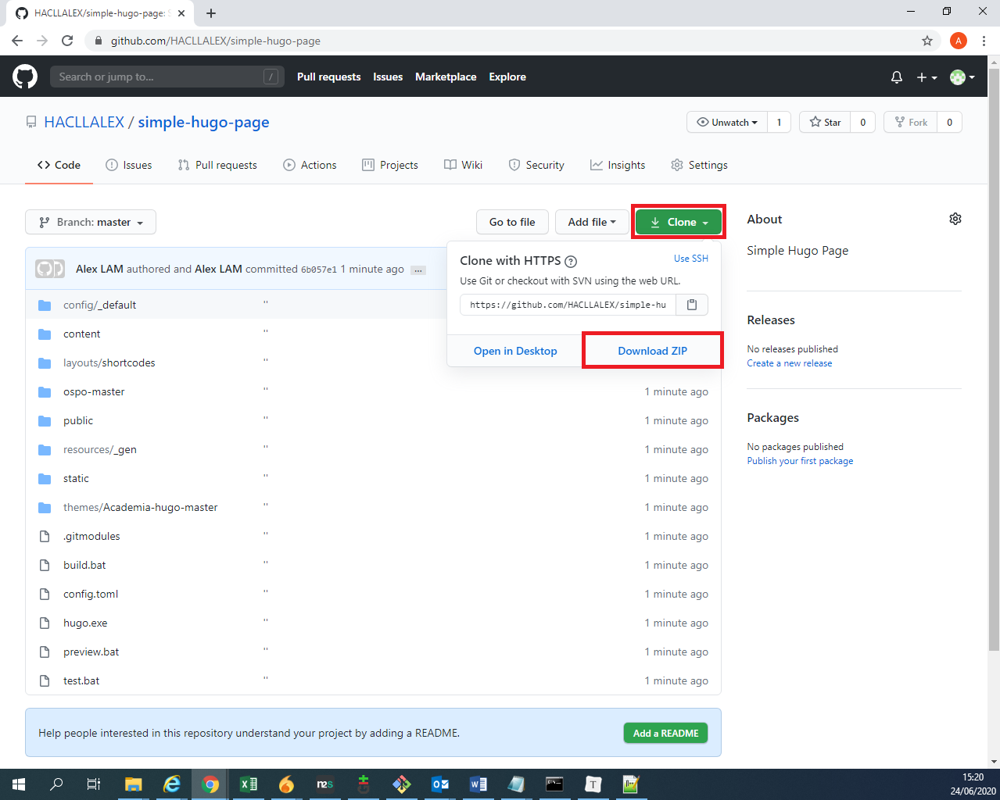
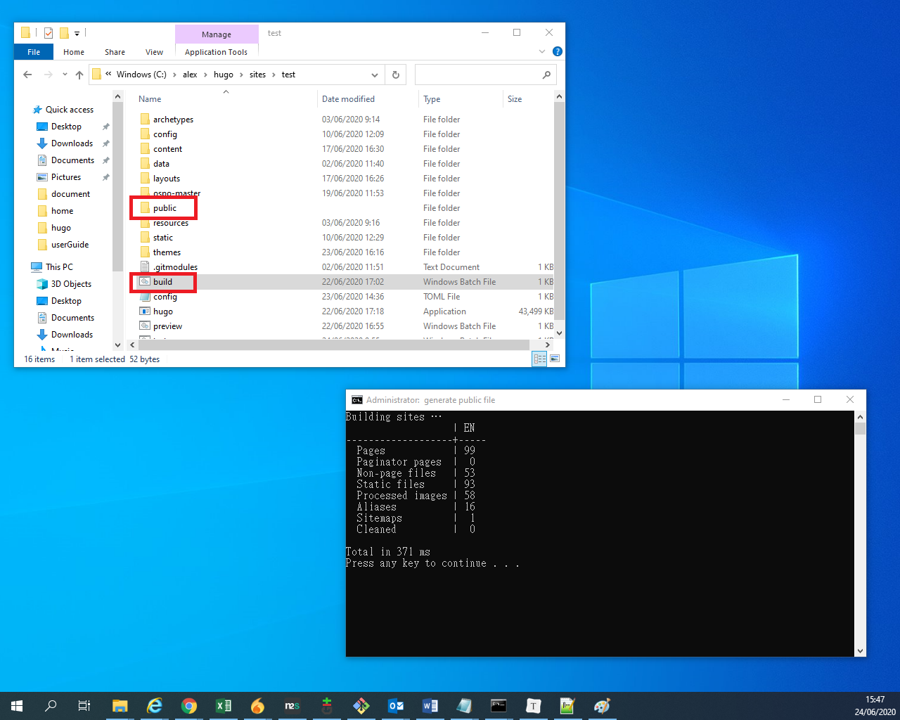
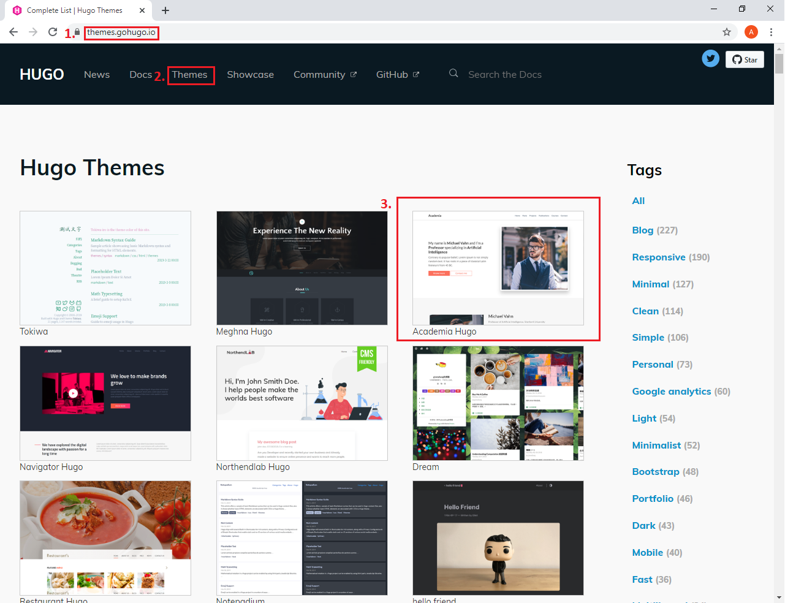
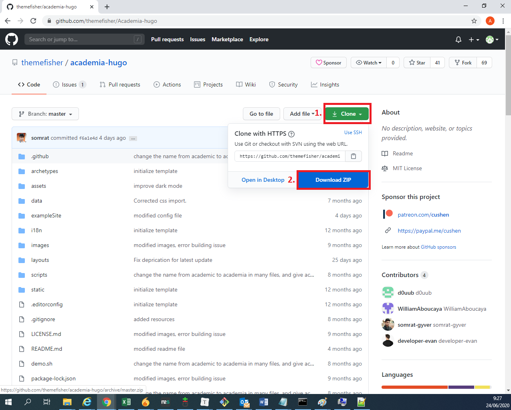
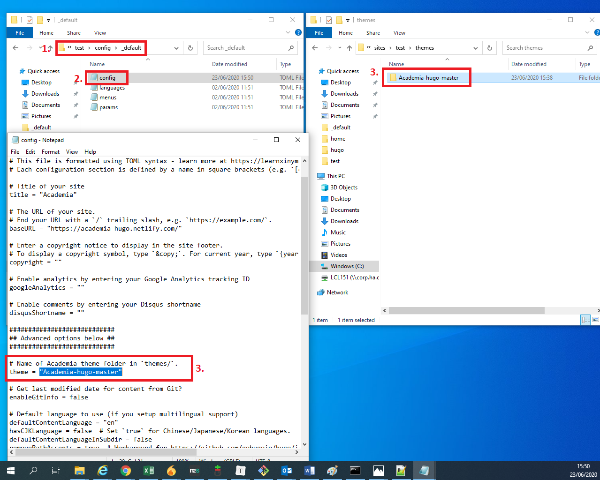

## 1. Quick Start

1. Go to [our github](https://github.com/HACLLALEX/simple-hugo-page) . Then, Click the **clone** and **download** the simple page. 
2. Unzip the file and run the **hugo.exe**.
3. Go to your hugo file and run the **preview.bat**. Then, open a browser and enter 'http://localhost:1313/'. Your hugo website is set up now.

## 2. Generate Deploy File

1. Go to your hugo file and run the **build.bat**. It will generate a **pubile** file. You can use the **pubile** for your deployment.

## 3. Add Themes

1. Go to [Hugo Themes](https://github.com/gohugoio/hugo/releases) .
2. Click the **Themes**. 
3. Choose a Themes. 
4. Click the **Download** button. It will 

1. Click the **Clone** button.
2. Click **Download ZIP**.
3. Unzip the file and put it into your hugo file **themes** folder.

1. Go to the path and find the config file

> config/_default

2. edit the config file as a notepad.
3. find the **theme = " "** and change the name of theme. The name sould be the same with your theme folder. 
