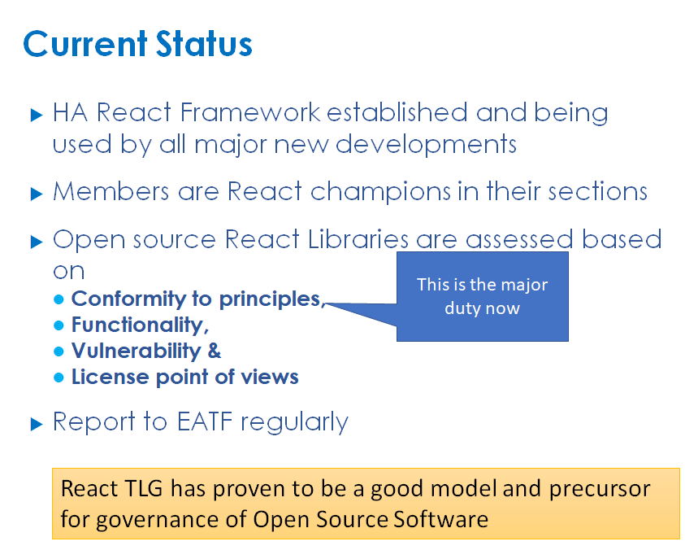
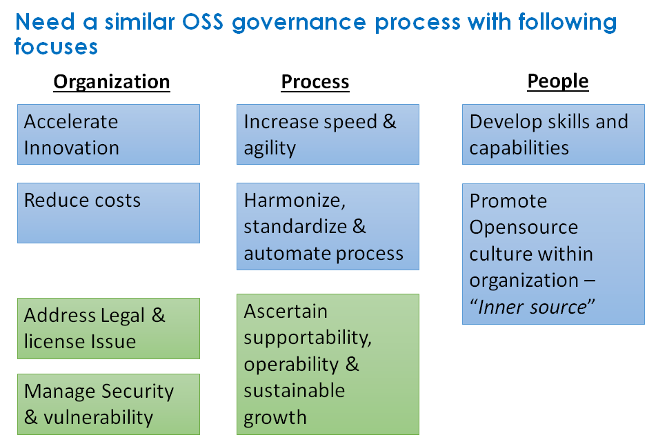
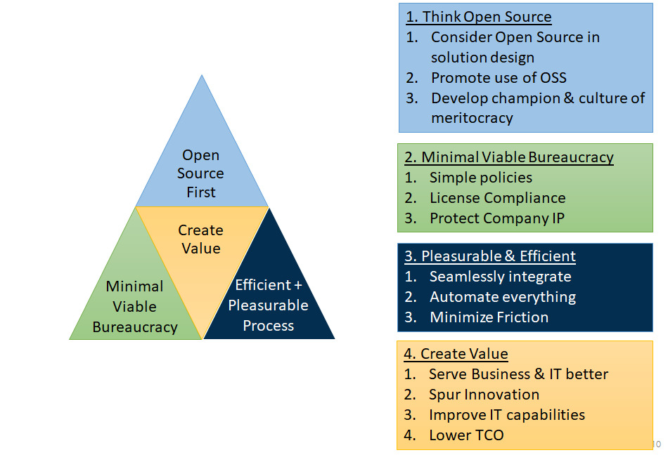
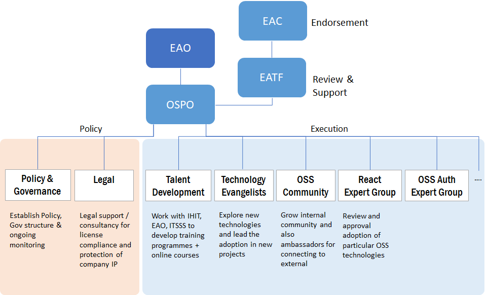

---

title : "OSPO Background"
subtitle : "OSS Governance – The React TLG experience and the way forward"
Date : "2020-01-02"
---

## Recap and Current Status of React TLG

### Term of Reference

- **Lead** the adoption of front-end framework based on React and related technologies in HA
- **Oversee** and provide direction to standardize front-end framework design and reference architecture based on React
- **Establish**, recruit and maintain a group of technical leads for React development
- **Review** and recommend changes of React framework components
- **Advice** to EATF for React framework related architectural decision

### Current work

- Upkeep HA’s React Framework
  - Conduct regular review of React components update / retirement of components 
  - Governance React framework – version upgrade/ new library adoption/ selection of react library with similar functionality
  - Formulate React-related workflow & architecture e.g. CI/CD workflow, private NPM 
  - Follow up open source licensing legal issue
  - Advise members on issue in React Project development
- Sharing
  - Sharing of React Project development
  - Sharing of latest technology

### Current Status

## Open Source Software (OSS) Governance Process and Principle

## 4 Guiding Principles

## Formation of Open Source Program Office

### **Objective of** **Open Source** **Program Office**

- A body to govern use of OSS in HA IT
- To promote & develop OSS culture in HA IT
- Suggestion
  - Form a Open Source Program Office
  - Establish TOR of Open Source Program Office
  - Invitation based with nomination by 4 departments + ISO + QAO
  - Managers + Domain Architects are recommended

### **Term of Reference of Open Source Program Office**

- **Spearhead** the adoption of OSS and related technologies in HA & ensure business alignment
- **Oversee** and provide direction to standardize the use and architecture of different types of OSS and establish OSS inventory
- **Champion** open source technical leads, train & upskill internal capability & promote OSS culture
- **Protect** company IP and license conformity
- **Advice** to EATF for OSS related architectural decision

### **Open Source Program Office Governance Structure**

