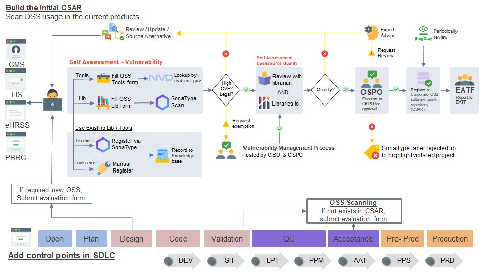

{}
You have to do `vulnerability check (step 1)`  even library / tools endorsed since vulnerability review subject to project nature
{}

### Process

The process of OSPO assist you to submit open source library to HA production artifactory with secure, efficient & reviewed quality. It included 4️⃣ steps and 3️⃣ roles

#### Steps:

1. Vulnerability Review (Self Assessment)
2. Quality Review (Self Assessment)
3. Endorse at OSPO (with librarian)
4. Report at EATF

#### R&R

1. Submitter - Endorse new open source library
2. Librarian - Support developer
3. Reviewer - Review & approve new open source tools / library

### Category

There have 2️⃣ categories in OSS process: 🔨`Tools`, 📚`Library`, please define it before go through the OSS process.

| Category | 🔨`Tools`               | 📚`Library`          |
| -------- | ---------------------- | ------------------- |
| GUI      | ⭕                      | ❌                   |
| Usage    | Direct Use             | Include to your App |
| Example  | Jenkins, Jasper Report | ReactJS,Jest        |