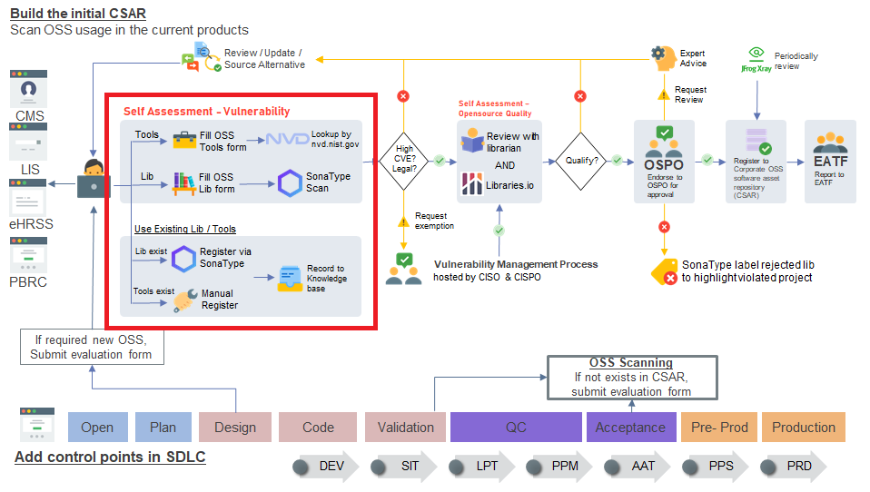
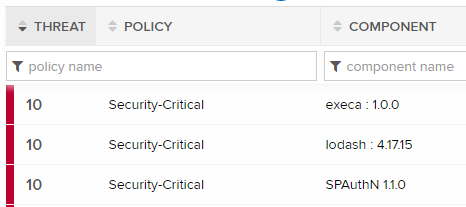
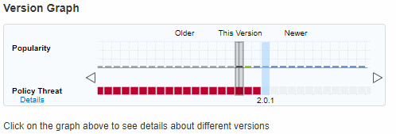
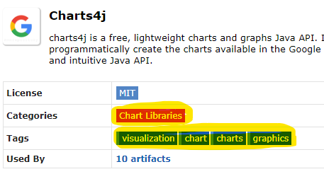

After you define the category, you have to go through the self assessment of security check.

---

### 📚Library

1. Scan with [SonaType](http://haitlc.home/Security/Open_Source_Software/OSS%20Monitoring%20and%20Control%20Process/Sonatype%20OSS%20Scanning%20Concept%20and%20Method/index.html)

2. Then get the list of vulnerabilities

   

3. You can fix with:

   - Library update - you can see the below sample, if you are direct use the library you can upgrade the library to the version without thread
     
   - Source for alternative - e.g. Charts4j, you can select the `categories` or `tags` in maven repo to get the similar library
    

4. If it won't work for you, please go through the [security review](#security-review)

5. if all libraries are endorsed before, no need go to next step

---

### 🔐Security Review

Security review is procedure to help you process and endorse opensource tools / library to vulnerability management process which hosted by Information Security Office (ISO).

Here are the steps:

1. Get the list of vulnerabilities scanned by SonaType
   - Endorsed library : Lookup suggested solution from [repostitories](/repostitories)
   - New library : 
2. Prepare the excel ([template](http://portal.home/sites/iso/SitePages/Process%20Request/Process%20Request.aspx))
3. Submit to ISO

