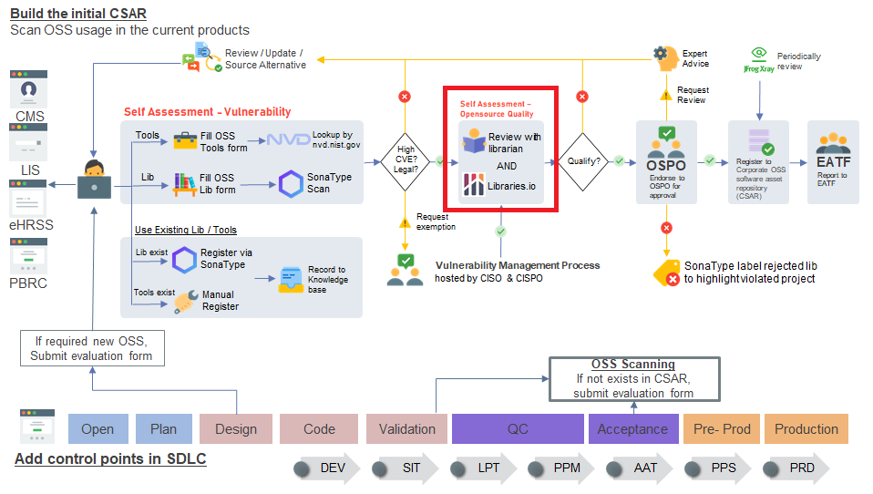
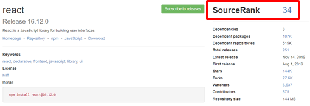
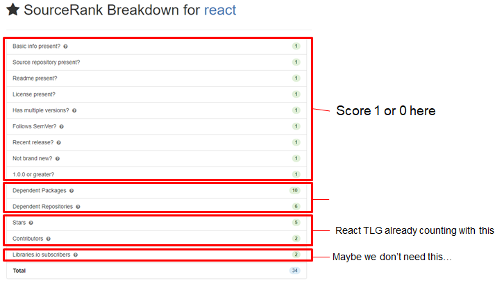

As we know that open source is coming from community, we are hard to verify the quality. Written by [github article](https://opensource.guide/metrics/#usage) suggest to use [libraries.io](https://libraries.io) to track usage statistics of open source project. We take libraries.io as a `REFERENCE` only.

### Steps

We take react as an example:

1. go to [libraries.io](http://libraries.io) input `react` and check the source rank

    

2. Reach to maximum is `30` score, if `< 10` it require librarian to review or use alternative. since it is not sync on time so we are take libraries.io as `REFERENCE` only.

### Details of Source Rank

SourceRank is the score for a package based on a number of metrics, it's used across the site to boost high quality packages.

The factors are based on attributes of a package that make it appear like a dependable package and can be handy to compare different packages.

for more information about Source Rank you can read the document [here](https://docs.libraries.io/overview#sourcerank)